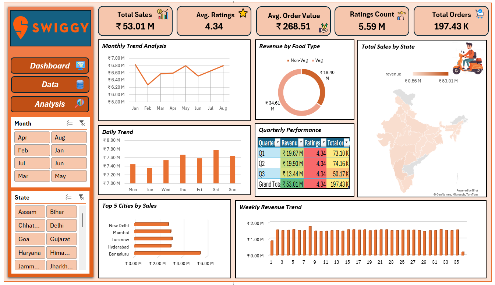

# 🥡 Swiggy Sales Data – Excel Analysis Dashboard

An interactive **Excel-based business intelligence dashboard** built to analyze Swiggy food-delivery sales, understand city/state revenue contribution, customer rating behavior, category trends (Veg vs Non-Veg), and uncover time-based demand patterns.

---

## 🚀 Project Overview
Food delivery platforms like **Swiggy** accumulate large volumes of order and customer data. Without visualization, decision-makers cannot identify **high-performing regions, customer trends, or business gaps**.

This project converts raw data into **actionable insights** using Excel — enabling business teams to **track sales, ratings, average order values, and peak demand periods** for strategic decision-making.

---

## 🧾 Problem Statement
Business leadership needs a **single-source dashboard** that answers:

- Which states & cities generate the highest sales?
- What is the month-wise & quarter-wise revenue trend?
- Do weekends generate more demand than weekdays?
- What is the sales share between Veg vs Non-Veg dishes?
- What are the Avg. Ratings and how many reviews contributed?

---

## 🎯 Objectives
✔ Aggregate & clean Swiggy order dataset  
✔ Build Excel pivot-based dashboard with KPIs  
✔ Enable monthly & regional comparison using slicers  
✔ Deliver visual insights to guide business decisions  

---

## 🧠 Dashboard Features
| Feature | Description |
|--------|-------------|
| 📊 KPI Cards | Total Sales, Total Orders, Avg. Rating, Avg Order Value |
| 🗺️ State Map | State-level revenue heat mapping |
| 🥗 Food Mix Analysis | Veg vs Non-Veg revenue breakdown |
| 📈 Trend Charts | Monthly & quarterly sales visualization |
| 📅 Day-wise Revenue | Weekend vs weekday sales |
| 🎛 Interactive Filters | Slicers for State & Month |

---

## 📈 Key Metrics (from sample dataset)
- **Total Sales:** ₹53.01M  
- **Highest Revenue Month:** July  
- **Top State by Sales:** New Delhi  
- **Avg. Rating:** ⭐ 4.34  
- **Category Split:** Non-Veg ~ 65% | Veg ~ 35%  

> 📌 Values may change if dataset is replaced.

---

## 🖼 Dashboard Preview 

---

🧰 Tools Used

- Microsoft Excel
- Pivot Table, Pivot Charts
- Slicers, Conditional Formatting
- Custom-designed dashboard background (Swiggy UI-theme)

---
🧳 Future Enhancements

🚧 Add SQL-based preprocessing
🚧 Automate reports using Power Automate
🚧 Export dashboard to Power BI for dynamic sharing

---
🤝 Contribute

Feel free to fork and modify. Pull requests are welcome.

📨 Contact

For collaboration or dashboard request:
📧 riagoyal.rg07@gmail.com
